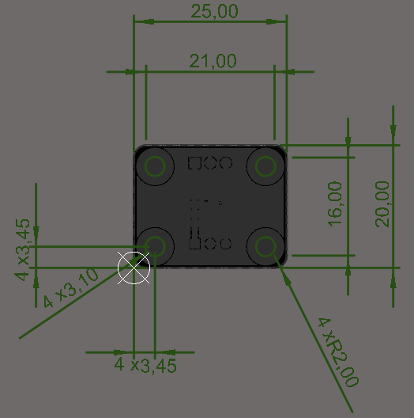
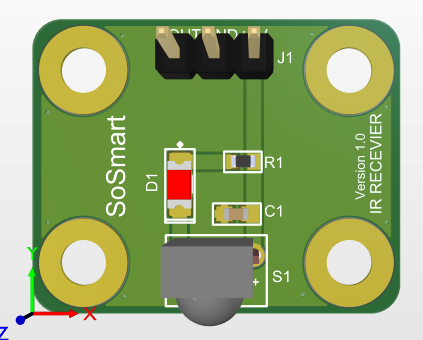
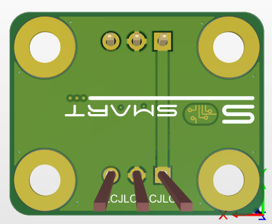
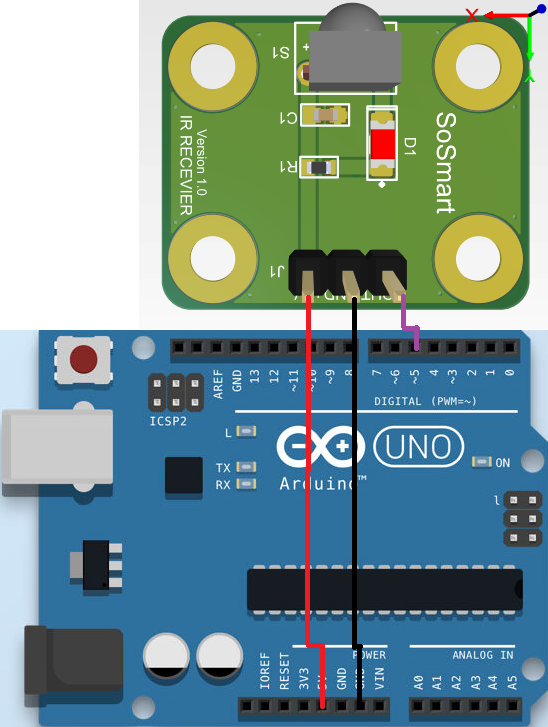
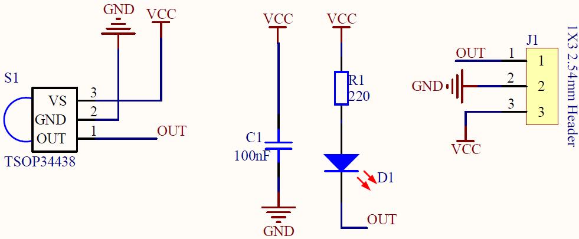

#  Kızılötesi Alıcı Sensör Kartı

### 1. KAPSAM

Bu döküman Kızılötesi Alıcı Sensör Kart'ının tanımını ve çalışma prensibini açıklar.

### 2. ÜRÜN PARAMETRELERİ
- 1 Çalışma Gerilimi: 2.5V ~ 5V DC
- 2 Çalışma Sıcaklığı: -25 ~ 85 °C 
- 3 Çalışma Frekansı: 38 KHz
- 4 Çalışma Menzili: 45 m


### 3. MEKANİK






### 4. PİN AÇIKLAMALARI

|Pin Adı|Açıklama|
|------|------|
|+5V|DC +5V besleme pimi|
|GND|Toprak bağlantı pimi|
|DOUT|Dijital çıkış pimi|


### 5. Arduino Bağlantısı



### 6. Devre


Sch File [MotorDriver](Circuit/IR_Reciver.pdf) 

Bom List [BomList](Circuit/IR_Reciver_BomList.pdf) 

Gerber File [Gerber](Circuit/IR_Reciver_Gerber.zip)

### GENEL BAKIŞ

Kızılötesi Alıcı Sensör Kartı IR uygulamalarında sensör kullanımını kolaylaştırmak için tasarlanmıştır.Prototiplemeye imkan sağlaması, arduino ve çeşitli devrelerde rahatça kullanılabilmesi için gerekli pinler devre kartı sayesinde dışarıya alınmıştır.Standart pin yapısı sayesinde rahatça kontrol edilebilir. Jumper kablolar ile bağlantıları yapılabilir.Kızılötesi sensör olarak TSOP34438 kullanılmıştır. Detaylı bilgi için linklere bakılabilir.

### Örnek Arduino Kodu
```

#include <IRremote.h> 
IRrecv irrecv(5); 
decode_results results;
void setup() {
  irrecv.enableIRIn();
  Serial.begin(9600); 
}
void loop() {
  if (irrecv.decode(&results)){ 
    Serial.println(results.value, HEX); 
    irrecv.resume();
  } 
}
```

[IR_ALICI](ArduionoExample/IR_ALICI/IR_ALICI.ino)
