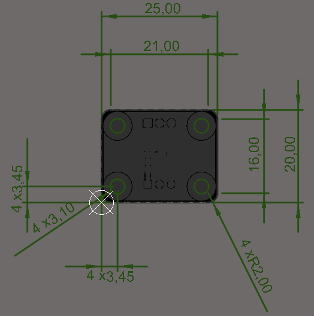
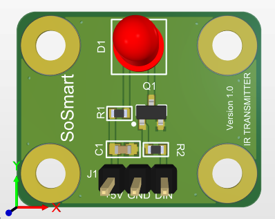
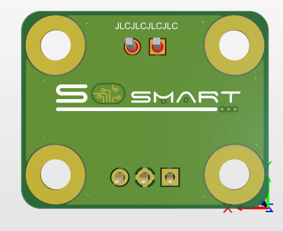
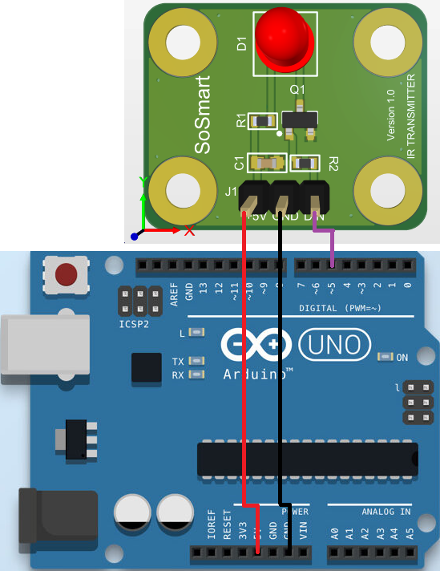
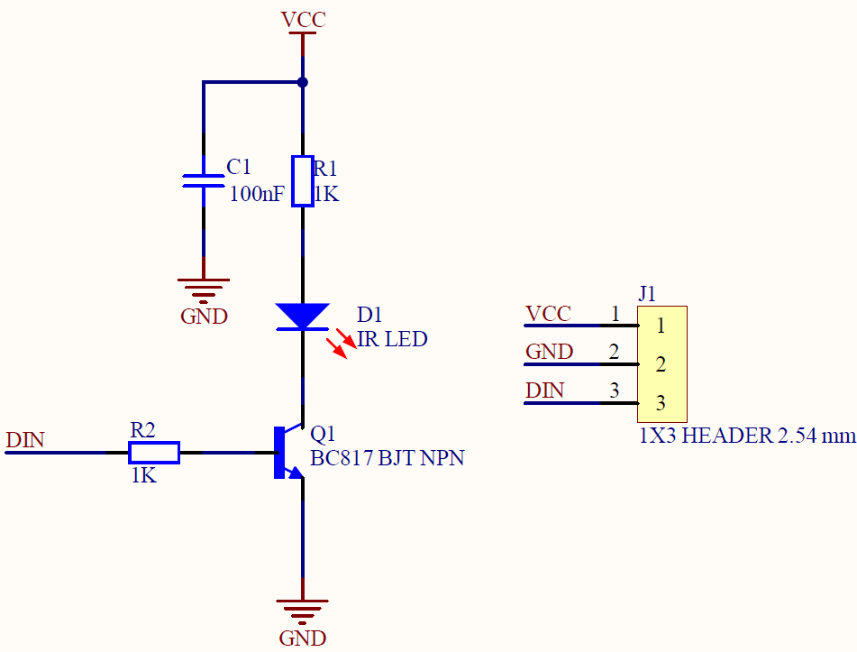

#  Kızılötesi Verici Sensör Kartı

### 1. KAPSAM

Bu döküman Kızılötesi Verici Sensör Kart'ının tanımını ve çalışma prensibini açıklar.

### 2. ÜRÜN PARAMETRELERİ
- 1 Çalışma Gerilimi: 2.5V ~ 5V DC
- 2 Çalışma Sıcaklığı: -40 ~ 85 °C 
- 3 Dalga Boyu: 950 nm


### 3. MEKANİK






### 4. PİN AÇIKLAMALARI

|Pin Adı|Açıklama|
|------|------|
|+5V|DC +5V besleme pimi|
|GND|Toprak bağlantı pimi|
|DIN|Dijital giriş pimi|


### 5. Arduino Bağlantısı



### 6. Devre


Sch File [IRModule](Circuit/IR_Tranciver.pdf) 

Bom List [BomList](Circuit/IR_Tranciver-BomList.pdf) 

Gerber File [Gerber](Circuit/IR_Tranciver_Gerber.zip)

### GENEL BAKIŞ

Kızılötesi verici Sensör Kartı IR uygulamalarında sensör kullanımını kolaylaştırmak için tasarlanmıştır.Prototiplemeye imkan sağlaması, arduino ve çeşitli devrelerde rahatça kullanılabilmesi için gerekli pinler devre kartı sayesinde dışarıya alınmıştır.Standart pin yapısı sayesinde rahatça kontrol edilebilir. Jumper kablolar ile bağlantıları yapılabilir.Kızılötesi verici sensör olarak SB-5010IRB kullanılmıştır. Detaylı bilgi için linklere bakılabilir.
### Arduino Örnek Kodu
```
int out=5;
void setup(){
  pinMode(out,OUTPUT); 
  }
 void loop(){
  digitalWrite(out,HIGH);
  delay(0.026);
  digitalWrite(out,LOW);
  delay(0.026);
  }
```
[IR_VERICI](ArduionoExample/IR_VERICI/IR_VERICI.ino)
